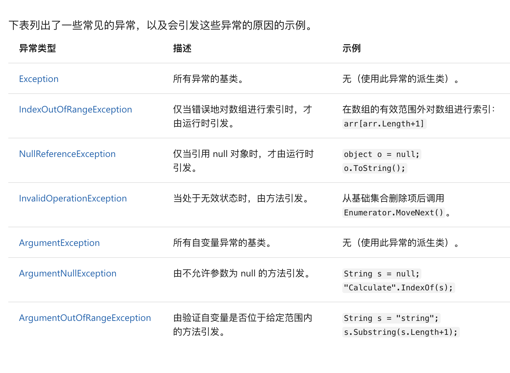
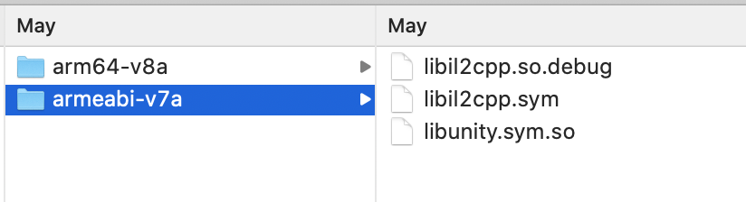

# Unity异常处理与分析


## 引言
对于程序开发者来说，异常可以理解为坏消息，为了避免异常我们需要良好的结构设计，完备的逻辑编写以及规范的代码格式。但是异常总会不和事宜的出现，针对可能异常的处理和异常的收集也至关重要。

此教程就针对异常处理，统计和分析进行展开讲解，
因为异常的内容知识非常庞大，特别是针对Android和iOS平台本身的Native异常，对于Native异常两个平台有大量的资料可供查阅学习，本教程给出了扩展链接，可以按需阅读。

## 核心要点
- Unity exception的介绍和异常处理
- Native crash的介绍
- 上报平台Unity/Appcenter/Firebase/Bugly对比分析
- 处理异常的一般原则和注意事项
- 上报事所必要的信息


## Unity Excepction
默认情况下C#代码下Exception并不会造成进程杀死，这样的情况如果异常产生后会中断当前执行的代码逻辑，可能会造成一系列意外的结果。iOS平台上Unity提供了`Fast but no Exceptions` 选项[保证所有Exception触发Crash](https://docs.unity3d.com/Manual/iphone-iOS-Optimization.html)。对于Android平台，Unity并没有这样的选项，但是我们可以通过全局异常捕获接口获得Exception，然后强制终止/重启程序或者弹出异常弹窗让用户选择终止或重。下面我们会从种类、构建、处理三个方面介绍异常。

###异常种类
Unity中Excepction都是派生于 `System.Exception`，下面是我们开发过程常见的Exception   	



 具体参阅：
 
[Handling and throwing exceptions in .NET
](https://docs.microsoft.com/en-us/dotnet/standard/exceptions/)

### 构建异常
通过 `throw` 关键字可以抛出自定义Exception，三个构造方法可选择:
	
```
public Exception(); 
public Exception(string message); 
public Exception(string message, Exception innerException); 
```
建议：
尽可能详尽的附加`message`信息
`innerException`可以附加捕获的Exception，可用于保留异常第一现场的调用栈


### 异常处理
#### 局部处理 
##### 使用try-catch-finally 语句

注意：**如果try作用域包含了异步处理，该异步处理产生的异常不会被捕获**
常见异步情况有：

- 协程（Coroutines）。 如果想要协程处理异常可以参考 [Catching Exceptions in Coroutines](https://www.jacksondunstan.com/articles/3718)
- 线程处理
- 其他延时操作，比如 `InvokeDelayed` 调用

##### 使用ContinueWith
如果使用了`Task`处理异步任务	，还可以使用 `ContinueWith `获得Task运行期间的Exception，运行线程和Task相同。
	
```
  Task.Run(() => { throw new CustomException("task1 faulted.");})
  .ContinueWith( t => { Console.WriteLine("{0}: {1}",
                                            t.Exception.InnerException.GetType().Name,
                                            t.Exception.InnerException.Message);
                        }, TaskContinuationOptions.OnlyOnFaulted);
```


#### 全局处理

Unity 本身提供了`LogCallback `监听程序Log和异常
	
``` c#
    /// <summary>
    ///   <para>Use this delegate type with Application.logMessageReceived or Application.logMessageReceivedThreaded to monitor what gets logged.</para>
    /// </summary>
    public delegate void LogCallback(string condition, string stackTrace, LogType type);
```
其中 `LogType` 是

```
  public enum LogType
  {
    Error,
    Assert,
    Warning,
    Log,
    Exception,
  }
```
看到`LogType `中有 `Exception `，然后我们通过`Application.logMessageReceivedThreaded`注册接口，就可以获得C#代码中未被捕获的的所有Exception了，需要注意的是`LogCallback`接口拿不到Exception实例，只有Excetipion信息和调用栈。


### Native Crash
前面我们介绍了Unity Exception，除了Unity托管代码本身产生的异常之外，运行平台也会有对应的异常，平台托管代码中产生的异常我们是Native Crash，另外这些异常错误直接造成App终止运行，也就是我们常说的Crash闪退了。
当然Native Crash也是跟随平台特性的不同也各有差异，具体到Android平台可以分为 `Java Exception` 和 `Android native crash` 两类，还有iOS平台的 `iOS native crash `
	
#### **Android Java Exception**：
发生在Android 虚拟机层面的异常，我们通过Java全局的异常捕获类`Thread.UncaughtExceptionHandler`拿到各个线程抛出的Exception。

例1-Java Exception

```
java.lang.ArithmeticException: divide by zero
    at com.lbj.mvpflower.mvp.ui.activity.UserActivity.onUser(UserActivity.java:36)
    at java.lang.reflect.Method.invoke(Native Method) 
    at android.view.View$DeclaredOnClickListener.onClick(View.java:4702) 
    at android.view.View.performClick(View.java:5619) 
    at android.view.View$PerformClick.run(View.java:22298) 
    at android.os.Handler.handleCallback(Handler.java:754) 
    at android.os.Handler.dispatchMessage(Handler.java:95) 
    at android.os.Looper.loop(Looper.java:165) 
    at android.app.ActivityThread.main(ActivityThread.java:6365) 
```	
更多详情：

- [Android捕获最少知识](https://www.jianshu.com/p/c13eb158d39e)

#### **Android Native Crash**:

简单理解Android的native crash就是发生在so库中异常，所以这些异常实际上就是Linux系统
常见导致Native Crash的原因有以下几种：

1. so库内部代码数组越界、缓冲区溢出、空指针、野指针等；
2. Android ART发现或出现异常；
3. 其他framework、Kernel或硬件bug；


例2-Android Crash

```
E/CRASH   (32251): signal 11 (SIGSEGV), code 1 (SEGV_MAPERR), fault addr 745a8008
E/CRASH   (32251): *** *** *** *** *** *** *** *** *** *** *** *** *** *** *** ***
E/CRASH   (32251): Build type 'Release', Scripting Backend 'il2cpp', CPU 'armeabi-v7a'
E/CRASH   (32251): Build fingerprint: 'Lenovo/A7600-F/A7600-F:4.4.2/KOT49H/A7600F_A442_000_027_141207_ROW:user/release-keys'
E/CRASH   (32251): Revision: '0'
E/CRASH   (32251): pid: 32251, tid: 10190, name: Flurry #82  >>> my.package.demo <<<
E/CRASH   (32251):     r0 77878008  r1 745a8008  r2 0000ac50  r3 00320057
E/CRASH   (32251):     r4 00310035  r5 00470062  r6 00730077  r7 006d0049
E/CRASH   (32251):     r8 00300068  r9 00000000  sl 6999eb88  fp 0002bc70
E/CRASH   (32251):     ip 00480064  sp 793f7a80  lr 007a0042  pc 400bd480  cpsr 793f7790
E/CRASH   (32251): 
E/CRASH   (32251): backtrace:
E/CRASH   (32251):         #00  pc 00026480  /system/lib/libc.so (__memcpy_base_aligned+52)
E/CRASH   (32251):         #01  pc 00020bf9  /system/lib/libbinder.so (android::Parcel::appendFrom(android::Parcel const*, unsigned int, unsigned int)+136)
E/CRASH   (32251):         #02  pc 0006cb9b  /system/lib/libandroid_runtime.so
E/CRASH   (32251):         #03  pc 0001e90c  /system/lib/libdvm.so (dvmPlatformInvoke+112)
E/CRASH   (32251):         #04  pc 0004fbbd  /system/lib/libdvm.so (dvmCallJNIMethod(unsigned int const*, JValue*, Method const*, Thread*)+484)
E/CRASH   (32251):         #05  pc 00027ce8  /system/lib/libdvm.so
E/CRASH   (32251):         #06  pc 0002f2f0  /system/lib/libdvm.so (dvmMterpStd(Thread*)+76)
E/CRASH   (32251):         #07  pc 0002c7d4  /system/lib/libdvm.so (dvmInterpret(Thread*, Method const*, JValue*)+188)
E/CRASH   (32251):         #08  pc 00062ef9  /system/lib/libdvm.so (dvmCallMethodV(Thread*, Method const*, Object*, bool, JValue*, std::__va_list)+340)
E/CRASH   (32251):         #09  pc 00062f1d  /system/lib/libdvm.so (dvmCallMethod(Thread*, Method const*, Object*, JValue*, ...)+20)
E/CRASH   (32251):         #10  pc 000575c5  /system/lib/libdvm.so
```

- 信号名：signal 11 (SIGSEGV)
- 信号产生的原因：code 1 (SEGV_MAPERR)
- 异常的内存地址：fault addr 745a8008（如果是SIGSEGV/SIGBUS等信号，一般都会有异常内存地址显示）
- 编译类型：il2cpp
- ABI信息：armeabi-v7a
- 设备型号：Lenovo
- Android系统版本：4.4.2
- 系统的build号：A7600FA442000027141207_ROW
- 系统的类型：user（对应有user/eng/userdebug/optional等，user表示是release版本，eng是调试版本）
- Crash的进程号：32251
- Crash的线程号：10190
- Crash的线程名称：Flurry #82（名称可能被裁减导致不全）
- Crash的进程名称：my.package.demo
- 中止消息：无（如果是SIGABRT，可能有类似javavmext.cc:504] JNI DETECTED ERROR IN APPLICATION: java_array == null这样的消息）
- 下面是 寄存器指向的内存地址：
> r0 77878008  r1 745a8008  r2 0000ac50  r3 00320057 ...

- 最后Native调用栈（栈帧序号-pc地址值-虚拟内存映射区域名称-（对应符号-符号偏移量）：	
>   #00  pc 00026480  /system/lib/libc.so (__memcpy_base_aligned+52)
> 	...

更多详情：
- [如何分析Android Native Crash](https://cloud.tencent.com/developer/article/1192001)

#### **iOS Native Crash**

与Android类似，iOS可以拿到的Crash记录也非常详细

例3-iOS Crash

```
Incident Identifier: D9857968-7AF7-40C0-BA05-192EF275F380
Hardware Model:      iPhone11,8
Process:             demo [4801]
Path:                /private/var/containers/Bundle/Application/03D4FE4F-26BC-47E5-A1D9-B8FF1D379B4A/demo.app/demo
Identifier:          my.bundleid.demo
Version:             2 (1.0)
AppStoreTools:       11E608a
AppVariant:          1:iPhone11,8:13
Beta:                YES
Code Type:           ARM-64 (Native)
Role:                Foreground
Parent Process:      launchd [1]
Coalition:           my.bundleid.demo [1515]


Date/Time:           2020-07-13 08:28:25.9201 +0700
Launch Time:         2020-07-13 08:27:57.4775 +0700
OS Version:          iPhone OS 13.3 (17C54)
Release Type:        User
Baseband Version:    2.03.07
Report Version:      104

Exception Type:  EXC_BAD_ACCESS (SIGBUS)
Exception Subtype: KERN_PROTECTION_FAILURE at 0x000000011b747ff0
VM Region Info: 0x11b747ff0 is in 0x11b734000-0x11b748000;  bytes after start: 81904  bytes before end: 15
      REGION TYPE                      START - END             [ VSIZE] PRT/MAX SHRMOD  REGION DETAIL
      MALLOC_LARGE           000000011b730000-000000011b734000 [   16K] rw-/rwx SM=PRV 
--->  CG raster data         000000011b734000-000000011b748000 [   80K] r--/r-- SM=PRV 
      MALLOC_LARGE           000000011b748000-000000011b74c000 [   16K] rw-/rwx SM=PRV 

Termination Signal: Bus error: 10
Termination Reason: Namespace SIGNAL, Code 0xa
Terminating Process: exc handler [4801]
Triggered by Thread:  38

Thread 0 name:
Thread 0:
0   libsystem_kernel.dylib           0x00000001b92c8c04 mach_msg_trap + 8
1   libsystem_kernel.dylib           0x00000001b92c8020 mach_msg + 76 (mach_msg.c:103)
2   CoreFoundation                   0x00000001b947b964 __CFRunLoopServiceMachPort + 220 (CFRunLoop.c:2575)
3   CoreFoundation                   0x00000001b94767fc __CFRunLoopRun + 1428 (CFRunLoop.c:2931)
4   CoreFoundation                   0x00000001b9475f40 CFRunLoopRunSpecific + 480 (CFRunLoop.c:3192)
5   GraphicsServices                 0x00000001c36f3534 GSEventRunModal + 108 (GSEvent.c:2246)
6   UIKitCore                        0x00000001bd5eea60 UIApplicationMain + 1940 (UIApplication.m:4773)
7   UnityFramework                   0x000000010281a330 -[UnityFramework runUIApplicationMainWithArgc:argv:] + 108 (main.mm:96)
8   demo                             0x0000000100eb7e1c main + 68 (main.mm:26)
9   libdyld.dylib                    0x00000001b92f4e18 start + 4

Thread 1:
0   libsystem_pthread.dylib          0x00000001b92119e0 start_wqthread + 0

Thread 2:
0   libsystem_pthread.dylib          0x00000001b92119e0 start_wqthread + 0

····
Thread 38 Crashed:
0   libsystem_platform.dylib         0x00000001b9206688 _platform_memmove + 408
1   UnityFramework                   0x000000010334f840 il2cpp::icalls::mscorlib::System::Buffer::BlockCopyInternal(Il2CppArray*, int, Il2CppArray*, int, int) + 176
2   UnityFramework                   0x0000000103aaee4c StreamWriter_Write_m8056BDE8A4AD4816F9D7DBDBCB80D03BE8F3ED14 + 192 (mscorlib9.cpp:21738)
3   UnityFramework                   0x0000000103ab22f4 UnexceptionalStreamWriter_Write_mAC310C8D24F673608DC7F130666E572ADD388E07 + 92 (mscorlib9.cpp:24996)
4   UnityFramework                   0x0000000103729968 Logger_Log_mC3BD9B8C40067382718BD9A54688A92599404E6B + 240 (SmartFox2X2.cpp:32959)
5   UnityFramework                   0x00000001036f8548 UDPManager_OnUDPData_mCD9304C4A4BD03D6F85EFAD9512893D4B2D037DC + 396 (SmartFox2X1.cpp:19687)
6   UnityFramework                   0x0000000103712ec0 OnDataDelegate_Invoke_mF1F76E2DCD9F8028B8956AE76035840B21615920 + 488 (SmartFox2X1.cpp:0)
7   UnityFramework                   0x00000001037175fc ThreadManager_InThread_m70E3D0A1EBE6F3AF67DFE1E8D50F54463DA49D10 + 180 (SmartFox2X2.cpp:18993)
8   UnityFramework                   0x00000001039fcb98 ThreadStart_Invoke_m11B6A66E82F02C74399A7314C14C7F52393CC4B4 + 284 (ClassInlines.h:0)
9   UnityFramework                   0x00000001039d0940 ContextCallback_Invoke_m76E65E7A67AA99858554F451E0F78E22B6478998 + 440 (ClassInlines.h:0)
10  UnityFramework                   0x00000001039d1bf8 ExecutionContext_RunInternal_m5BF955CE8B04D9A7C959B9011579CC0FABD5FC56 + 316 (mscorlib19.cpp:30738)
11  UnityFramework                   0x00000001039fcb98 ThreadStart_Invoke_m11B6A66E82F02C74399A7314C14C7F52393CC4B4 + 284 (ClassInlines.h:0)
12  UnityFramework                   0x000000010286b620 RuntimeInvoker_TrueVoid_t22962CB4C05B1D89B55A6E1139F0E87A90987017(void (*)(), MethodInfo const*, void*, void**) + 20 (Il2CppInvokerTable.cpp:18279)
13  UnityFramework                   0x00000001033925c8 il2cpp::vm::Runtime::Invoke(MethodInfo const*, void*, void**, Il2CppException**) + 116
14  UnityFramework                   0x000000010335c678 il2cpp::icalls::mscorlib::System::Threading::ThreadStart(void*) + 108
15  UnityFramework                   0x0000000103365a7c il2cpp::os::Thread::RunWrapper(void*) + 88
16  UnityFramework                   0x0000000103367d14 il2cpp::os::ThreadImpl::ThreadStartWrapper(void*) + 40
17  libsystem_pthread.dylib          0x00000001b9209840 _pthread_start + 168 (pthread.c:896)
18  libsystem_pthread.dylib          0x00000001b92119f4 thread_start + 8

····

Binary Images:
0x100eb0000 - 0x100eb7fff demo arm64  <14cde28b305d3bffb8abdfab5a30df25> /var/containers/Bundle/Application/03D4FE4F-26BC-47E5-A1D9-B8FF1D379B4A/demo.app/demo
0x100f80000 - 0x100f8bfff libobjc-trampolines.dylib arm64e  <028df612175838e498958fd8c6a9a03c> /usr/lib/libobjc-trampolines.dylib

```
上面省略了其他线程的信息

- Incident Identifier : Crash唯一ID
- Hardware Model: 设备型号
- Process: 可执行文件名
- Identifier ：Bundle ID
- Code Type : CPU架构
- OS Version: 系统版本号号
- Report Version ：崩溃日志版本号
- Exception Type - Termination Reason： 是异常的类型和原因
- Triggered by Thread:  38 : 引发的线程
- Thread 0: 主线程
- 崩溃发生的堆栈 (位置， 地址， 函数符号+ 偏移量）：  
>  0   libsystem_kernel.dylib           0x00000001b92c8c04 mach_msg_trap + 8

- Binary Images:  二进制文件内存信息 ( 地址起始-地址结束 名称 CPU架构 **UIID** 路径）
> 0x100eb0000 - 0x100eb7fff demo arm64  <14cde28b305d3bffb8abdfab5a30df25> /var/containers/Bundle/Application/03D4FE4F-26BC-47E5-A1D9-B8FF1D379B4A/demo.app/demo

更多详情：

- [iOS Crash日志结构介绍](https://jianli2017.top/wiki/IOS/crash/1_system_Crash_Type/)
- [了解和分析iOS Crash Report](https://juejin.im/post/6844903774780145678)


对于Debug环境中我们拿到的Crash日志通常都是带有符号的，也就是我们可以追踪到具体的crash方法和行号。如果Crash堆栈没有解析符号表，这种情况就需要我们手动解析符号表了，当然很多Crash平台都集成了解析符号表的功能，我们只需要自己上传即可。下面我们就介绍下符号表相关的知识。

### 解析符号表
为了能快速并准确地定位用户APP发生Crash的代码位置，我们使用符号表对APP发生Crash的程序堆栈进行解析和还原， 比如一个iOS的crash堆栈：

##### 符号表
简单来说，符号表是内存地址与函数名，文件名，行号的映射表
> <起始地址> <结束地址> <函数> [<文件名:行号>]


- 对于Android工程，一般情况下我们采用 il2cpp 方式构建，unity-2018.4会把符号表自动打包成一个压缩包文件。后缀 `.symbols.zip`,  存放位置和 `.apk` 文件在同一目录。


- iOS系统的下的符号表就是dSYM文件，文件名通常为：xxx.app.dSYM。我们使用xcode编译完项目后，会生产dSYM文件，和app文件在同一个目录下

符号表相关的知识参考：
Bugly官方手册 - [Android符号表](https://bugly.qq.com/docs/user-guide/symbol-configuration-android/?v=20200622202242)，[iOS符号表](https://bugly.qq.com/docs/user-guide/symbol-configuration-ios/?v=20200622202242) 

##### 解析符号表
拿到符号表，并且确认**UIID一致**的情况下，我们就可以进行工具进行堆栈符号解析了。
 
- Android平台下可以使用NDK库中 `add2line ` `ndk-stack` 工具，`ndk-stack`可以对Android的Crash-Log进行提取和解析，非常方便在拿到Crashlog的情况下分析。
我们通过以下命名可以获取实时的Crash信息
> adb shell logcat | ndk-stack -sym $PROJECT_PATH/obj/local/armeabi  
更多内容请翻阅：
[Android Native crash日志分析](https://www.cnblogs.com/willhua/p/6718379.html)

- iOS平台下两种工具`symbolicatecrash ` 和`atos ` ，`symbolicatecrash`其实就是对`atos`的封装 
更多内容请翻阅：
[OS Crash分析必备：符号化系统库方法](https://zuikyo.github.io/2016/12/18/iOS%20Crash%E6%97%A5%E5%BF%97%E5%88%86%E6%9E%90%E5%BF%85%E5%A4%87%EF%BC%9A%E7%AC%A6%E5%8F%B7%E5%8C%96%E7%B3%BB%E7%BB%9F%E5%BA%93%E6%96%B9%E6%B3%95/)
	

 	
## Unity上报平台的选择

### 主流上报平台的对比分析
Unity异常上报通常有四家较为主流的平台，

 - [Bugly](https://bugly.qq.com/docs/user-guide/instruction-manual-plugin-unity/?v=20200312155538) 
 - [Appcenter](https://docs.microsoft.com/en-gb/appcenter/sdk/crashes/unity)
 - [Unity Cloud Diagnostics](https://unitytech.github.io/clouddiagnostics/) 
 - [Firebase](https://firebase.google.com/docs/crashlytics/get-started?authuser=0&platform=unity) 
 
这里对各个平台的特点梳理了一个表格，集成后可以参阅(标绿的部分是**明显优势项**，表格中仅拿Android项目进行了测试统计）：


根据咱们公司风控要求，**Bugly仅限于只在国内发行的App使用**，**Firebase当前阶段禁止使用**，因此产品的集成平台是建议选用以下组合：
> 国内产品推荐：Bugly, Unity
> 
> 海外产品推荐：Appcenter, Unity


### 搭建自己的上报平台
前面介绍了第三方Crash或者Unity平台，假如我们需要上报到自己的平台，需要分几个方面进行处理，这些可以单独进行集成：
1. Exception 捕获
2. Native Crash, 包括Android和iOS平台

#### 全局异常处理
前面已经讲过 `Application.logMessageReceivedThreaded`注册接口可以获取全局的Exception，所以Unity托段代码的异常获得还是非常简单的，实现对应的接口方法即可监听。

#### iOS 异常
iOS平台提供了捕获异常的接口：

```
/* Set the uncaught exception handler */
NSSetUncaughtExceptionHandler(&uncaught_exception_handler);
```
如果同时使用了注册了第三方的Crash平台， 需要先保存第三方的 ExceptionHandler，然后在设置自己处理 exception 的 ExceptionHandler，在自己的 ExceptionHandler 处理完异常之后，再将异常交给第三方处理。

如果需要集成服务端解析符号表，请参考：
 [有赞 crash 平台符号化实践](https://www.infoq.cn/article/JLtuf3PGfJV6ovjzu1sq?utm_source=related_read_bottom&utm_medium=article)
 
#### Android Java 异常
Android平台也提供了处理Java异常的全局接口 `Thread.UncaughtExceptionHandler`， 我们实现此接口通过
`Thread.setDefaultUncaughtExceptionHandler` 注册给系统即可。同样iOS平台类似，应为此接口值接受一个Handler，需要先通过 `Thread.getDefaultUncaughtExceptionHandler` 获取之前的Handler，再根据需要将捕获的Exception进行转交。

#### Android Native 异常
Android 平台可以使用 [google breakpad](https://github.com/google/breakpad) 捕获native crash， Appcenter平台就是采用的该方案。
 

## 异常处理和上报

当我们了解了所有的异常类型，也选择了合适的上报平台，最后就可以进行异常上报了。通常第三方都会主动收集异常信息，`AppCenter`这样的平台甚至会主动上报Error的log, `Bugly`的Android平台还是收集 logcat日志信息。 除了平台做的这些事情我们还需要注意两件非常重要的事情，来快速定位Crash：

1. 恰当的处理异常：异常的信息能够发现具体的**异常原因** 和 **异常发生位置**
2. 上报异常之外的其他信息，进行辅助判断，因为很多的native异常位置指向性并不能定位原因。

#### 恰当的处理异常

##### 正确使用try-catch-finially语句处理异常。

- `try`的作用域尽量单一，方便错误定位。
- `catch`中做恢复资源，如果不能正确处理请上报事件或debug下输出错误，最后或者是重新throw。
- `finally`中清理资源，可以不`catch` Exception，仅使用try-finally做资源闭环处理。

	
另外更多使用规则请参阅
 [Best practices for exceptions](https://docs.microsoft.com/en-us/dotnet/standard/exceptions/best-practices-for-exceptions)

##### throw 关键字使用


* `throw [e];`  抛出一个异常，调用栈是当前调用方法。

注意： 当try-catch中 抛出一个新的异常，捕获的异常的调用栈并不是真正错误来源。如果需要保留catch的Exception，需要使用下面的构建方法：
> `public Exception(string message, Exception innerException);`

一个常见的用法：

```c#
public class ProcessFile
{
    public static void Main()
    {
        FileStream fs;
        try
        {
            fs = new FileStream("data.txt", FileMode.Open);
            var sr = new StreamReader(fs);
            	// ....
        }
        catch(FileNotFoundException e)
        {
            Console.WriteLine($"[Data File Missing] {e}");
            throw new FileNotFoundException(@"[data.txt not in c:\temp directory]", e);
        }
        finally
        {
            if (fs != null)
                fs.Close();
        }
    }
}
```

 * `throw;`  重新抛出try-catch的异常 ，通常可作为代码异常的监听，但不做拦截
 
##### 方便确定异常发生的位置
il2cpp目前并不记录异常代码的行号，这对定位产生了一定的困难。以下几个点可以让我们更加方便确定异常的位置：

- 编写职责单一的方法，方法行数不易过多。
- 异常捕获时提供额外信息。
- 准确记录堆栈路径，通常是自己构建Exception时注意保留Catch的Exception堆栈。

		
#### 上报关键信息

我们可以通过反馈入口或者异常捕获拿拿到线上用户的现场信息，为了方便定位Crash，应当尽量提供一下现场信息

-  设备信息： 包括设备基本类型，系统版本，系统语言，定义的UIID, 内存情况，存储情况(需要单独实现Native接口）等

```
SystemInfo.deviceModel,
SystemInfo.deviceName,
SystemInfo.deviceType,
SystemInfo.deviceUniqueIdentifier,
SystemInfo.operatingSystem,
Localization.language,
    
SystemInfo.systemMemorySize,
SystemInfo.processorCount,
SystemInfo.processorType,
Screen.currentResolution.width,
Screen.currentResolution.height,
Screen.dpi,
Screen.fullScreen,
    
SystemInfo.graphicsDeviceName,
SystemInfo.graphicsDeviceVendor,
SystemInfo.graphicsMemorySize,
SystemInfo.graphicsPixelFillrate,
SystemInfo.maxTextureSize,
```

-  应用信息：运行时间，异常时所在界面，用户操作的动作链等
- Trace事件：为了方便业务分析，我们在开发过程会上报事件用户埋点分析，除此之外我们可以提供Trace事件类型，主要来统计模块加载和错误输出，发生异常是可以根据场景附加上多个事件集合。
- 日志文件：在可能的情况下，附加当前应用的日志文件，AppCenter提供了附加文件的接口，我们可以将日志文件一并上传。
- 反馈接口：用户提供额外的文字描述和截屏。

## 测试题
1. 关于Unity C# Excepction，下列说法正确的是：

A. Android程序发生了 C# Exception默认情况下会造成Crash闪退。

B. `Fast but no Exceptions` 的意思是运行速度快并且不会产生Crash闪退。

C. 使用 `public Exception(string message, Exception innerException); ` 构造方法可以保留innerException的调用堆栈。

D.  try-catch 不能捕获协程中的异常

答案: CD

2.  Unity LogCallback接口就是日志的回调，可以获得日志，但不能拿到Exception的实例 

答案:  对（只能拿到Exception的message和callstack属性）

3. Native Crash 下列说法错误的是：
A. Java Excpeption会造成程序终止
B. 在符号表的前提下， iOS Crash可以获得异常堆栈的行号
C. 可以使用 `ndk-stack` 和 `atos` 解析 Android native crash
D. dSYM 是iOS编译过程中生成的符号表文件

答案 ： C

4.  虽然国内的Android产品不能使用 `Firebase` ，但海外的产品都可以使用

答案 错

5. 下列说法正确的是：

A. throw 关键字可以单独使用，不用跟随Exception对象。
B. 可以不适用catch语句，使用try-finally进行及时的资源释放。
C. 日志文件可以让我们更快的定位Crash原因，各大平台中仅bugly提供Logcat日志获取。
D. 为了方便定位错误发生位置，应当编写职责单一的方法，方法行数不易过多。

答案: ABCD


